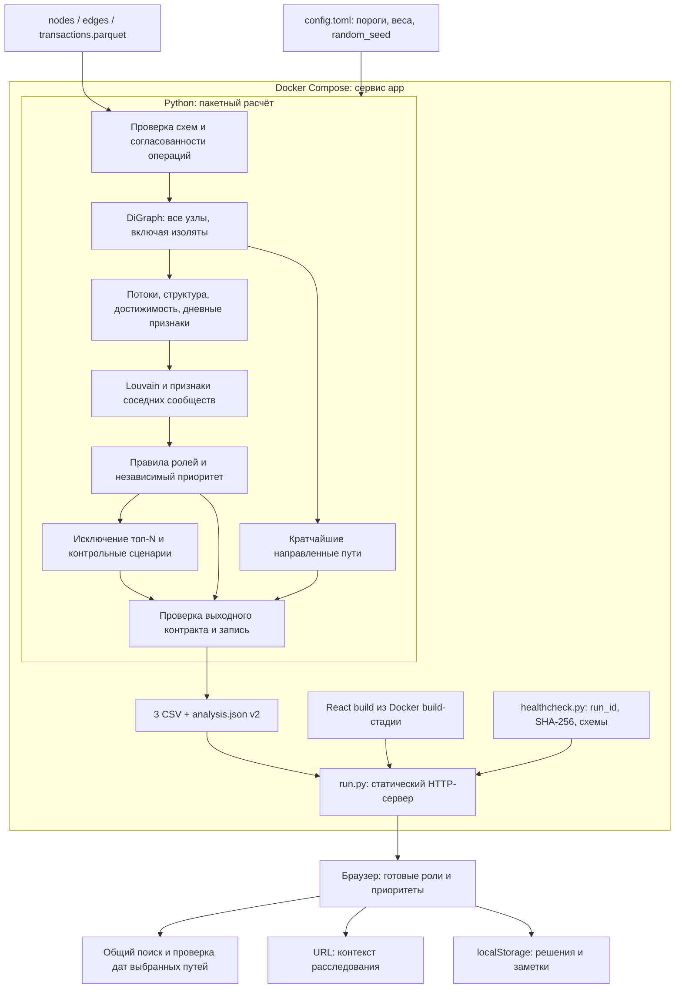

# Граф денег · HackAlem

## 1. Краткое описание

«Граф денег» — локальная система анализа транзакционной сети, которая помогает AML-аналитику определить, каких участников проверять первыми и почему. Она преобразует три Parquet-файла в направленный граф, рассчитывает признаки, гипотезы ролей, сообщества и приоритеты, затем публикует согласованные CSV-выгрузки и данные для браузера. Решение рассчитано на пакетную обработку обезличенной выборки: 2 248 узлов, 3 119 связей и 4 840 операций за июль 2026.

**Роли — проверяемые гипотезы. Баллы не являются вероятностью нарушения или доказательством виновности.**

## 2. Технический стек

| Категория | Технологии | Ответственность |
|---|---|---|
| **Core** | Python 3.12.13; React 19.3, TypeScript 7.0, Vite 8.3 | Пакетный расчёт, статический HTTP-сервер, браузерный клиент |
| **Data** | Parquet, pandas 3.0.6, PyArrow 25.0.1, NumPy 2.5.3 | Валидация, агрегация, признаки и сериализация |
| **Графовая аналитика / AI/ML** | NetworkX 3.7, SciPy 1.18.1 | PageRank, betweenness, достижимость, Louvain, объяснимые правила ролей; обучаемых моделей и LLM в runtime нет |
| **Визуализация** | Cytoscape.js 3.34.3 | Направленные подграфы и маршруты из результатов расчёта |
| **Infra** | Docker, Docker Compose, uv 0.11.21 | Multi-stage build, фиксированное окружение, запуск и healthcheck |
| **Проверки** | pytest 9.1.1, Playwright 1.63.0, TypeScript | Аналитические инварианты, контракт данных, браузерные сценарии и проверка типов |

Python-зависимости зафиксированы в [pyproject.toml](pyproject.toml) и [uv.lock](uv.lock), frontend — в [package.json](web/package.json) и [package-lock.json](web/package-lock.json). Базовые образы в [Dockerfile](Dockerfile) закреплены версиями и digest. PostgreSQL, Redis и отдельный API-сервис не используются.

## 3. Архитектура и поток данных

### Системная схема



### Границы компонентов

| Компонент | Что делает | Почему отдельно |
|---|---|---|
| [starter.py](case/starter/starter.py) | Читает и проверяет Parquet; строит граф, признаки, сообщества, пути и сценарии устойчивости; формирует результаты | Единый расчёт для CSV и браузера исключает расхождение ролей и рейтингов |
| [scoring.py](case/starter/scoring.py) | Применяет правила ролей и нормализует компоненты приоритета | Правила можно проверить по признакам и конфигурации без запуска интерфейса |
| [run.py](run.py) | Запускает расчёт; после успешного завершения обслуживает каталог результата и собранный frontend | HTTP не открывается до проверки данных; Parquet и исходный код не публикуются |
| [healthcheck.py](healthcheck.py) | Сравнивает локальный и HTTP-манифесты запуска, хеши файлов, схемы и число строк | Готовность означает доступность согласованных результатов, а не только открытый порт |
| [web/src](web/src/) | Загружает и валидирует `analysis.json`, выполняет интерактивные обходы графа и проверку дат | Роли и приоритеты не пересчитываются в браузере; запросы аналитика не требуют нового Python-процесса |

Входящие и исходящие суммы сохраняют направление переводов. Для Louvain строится отдельная ненаправленная проекция: встречные потоки суммируются, самопереводы исключаются из кластеризации. Изолированные узлы остаются в полном графе и получают собственные кластеры. При фиксированных входных данных и конфигурации повторный расчёт даёт побайтово одинаковые CSV и JSON; идентификатор запуска `run_id` при этом меняется.

### Объяснимая аналитика

Пороговые правила находятся в [config.toml](config.toml); обоснование порогов и формулы — в [ANALYTICS.md](docs/ANALYTICS.md). Исходный клиент (`seed`) — один из 81 участников, от которых собиралась выгрузка.

| Роль | Условия при конфигурации по умолчанию |
|---|---|
| `consolidator` | ≥3 плательщиков; достижимость от ≥2 исходных клиентов; доля крупнейшего плательщика ≤80% |
| `distributor` | ≥5 получателей; доля крупнейшего получателя ≤80% |
| `transit` | Не исходный клиент; есть плательщики и получатели; вход и выход ≥164 528 ₸; отношение выхода ко входу 0,7–1,4; доля выхода с поступлением в предшествующие 0–2 дня ≥69% |
| `terminal` | Не исходный клиент и не граница обхода; есть плательщик; вход ≥164 528 ₸; отношение выхода ко входу ≤10% |
| `coordinator` | Достижимость от ≥9 исходных клиентов; ≥2 внешних соседних кластеров; betweenness ≥0,0001553 |
| `peripheral` | Остальные правила не выполнены |

Выбирается роль с максимальным допустимым баллом; конкурирующая гипотеза снижает итоговый `role_score`. При равенстве применяется `role_order` из конфигурации. Приоритет рассчитывается независимо от выбранной роли: **35% охвата исходных клиентов + 40% структуры + 25% оборота**, с логарифмической нормализацией признаков. Каждый вклад сохраняется отдельно, равенства разрешаются по числовому `gid`.

Браузерный поиск пересекает множества узлов, достижимых от 2–5 выбранных исходных клиентов, и исключает уже известных участников. Для каждого кандидата строятся кратчайшие направленные пути. Проверка дат сначала ищет строго возрастающую последовательность операций, затем неубывающую; результат различает согласованный порядок, неопределённость внутри дня и конфликт дат. Это проверка конкретного маршрута, без автоматического поиска альтернативных маршрутов по времени.

Промптов, агентного цикла и обращений к LLM API нет. Объяснения формируются из рассчитанных признаков и правил, поэтому их можно сопоставить с исходными данными.

### Контракт, публикация и хранение

| Результат | Контракт |
|---|---|
| `nodes_roles.csv` | Все 2 248 узлов: `gid`, `role`, `role_score`, `cluster_id`, `priority_score`, `evidence` и дополнительные признаки; `evidence` ≤200 символов |
| `clusters.csv` | `cluster_id`, `n_nodes`, `n_seed`, `sum_kzt_internal`, `top_gids`, `hypothesis`; на текущих данных 88 кластеров |
| `top_nodes.csv` | Все узлы по убыванию приоритета: `rank`, `gid`, `role`, `priority_score`, `why` |
| `analysis.json` | `schema_version=2`; метаданные и конфигурация, узлы, связи с датами, кластеры, рейтинг и сценарии устойчивости |
| `ready.json` | Манифест текущего HTTP-запуска: `run_id`, число узлов и SHA-256 опубликованных файлов |

`gid` передаётся в JSON строкой: 64-битные идентификаторы нельзя безопасно преобразовывать в JavaScript `number`. В обязательных CSV идентификаторы записаны десятичными целыми; при импорте в электронную таблицу выбирайте текстовый тип столбца. `top_gids` и `seed_path_gids` в CSV — JSON-массивы строк; неопределённые дополнительные отношения представлены пустым значением в CSV и `null` в JSON. Обязательные поля заполнены, скоры в файлах лежат в диапазоне 0–1.

Результаты сначала проверяются и записываются во временный каталог, затем каждый файл заменяется через `os.replace`. Это атомарная замена отдельных файлов, не транзакция всего набора. Согласованность при обслуживании обеспечивается порядком запуска и эксклюзивной блокировкой каталога: блокировка удерживается до остановки HTTP-сервера. При ошибке расчёта новый сервер не запускается.

В Compose не настроены volumes: `/app/out` находится в файловом слое контейнера, при пересоздании результаты рассчитываются заново. Контекст расследования хранится в URL, а решения и заметки — в `localStorage` браузера с привязкой к периоду и `gid`. Сервер не принимает эти записи; передача решений выполняется CSV-выгрузкой, синхронизации между устройствами нет.

### Архитектурные решения — ADR

1. **Пакетный расчёт и статическая публикация.** Вход — конечная выгрузка, обновления в реальном времени не требуются. Один процесс расчёта и файловый контракт упрощают воспроизводимость и позволяют обходиться без БД, очередей и отдельного backend API. Компромисс: новые данные требуют полного пересчёта.
2. **Правила и графовые метрики вместо обученной модели.** В датасете нет размеченных ролей. Явные пороги позволяют объяснить каждую гипотезу и проверить чувствительность результата; оценка accuracy без разметки не заявляется.
3. **Вычислительное ядро в Python, интерактивные запросы в браузере.** Python формирует единую модель анализа, React работает с её снимком. Это обеспечивает локальный запуск без внешних API; компромисс — весь JSON загружается в память клиента и подходит текущему объёму, а не миллиону узлов.

### Ограничения и масштабирование

Выборка включает только внутрибанковские операции ≥5 000 ₸ за июль 2026 и четыре шага исходящего обхода. Входящие исходных клиентов неполны; дальнейшие переводы 444 граничных узлов неизвестны. Поэтому отсутствие исходящих не используется как достаточное основание для `terminal` на границе. Достижимость и согласованные даты не доказывают движение одной суммы; оборот повторно учитывает деньги вдоль цепочек. Проверка устойчивости моделирует связность наблюдаемого графа, а не эффект реального блокирования счетов.

При росте до ~1 млн узлов потребуется заменить полный граф NetworkX и точную betweenness компактным графовым представлением и приближёнными метриками, выполнять агрегации пакетно, а подграфы и списки выдавать порционно через API. Браузеру следует передавать выбранную область сети вместо полного JSON. Эти изменения описывают направление развития и не входят в текущую реализацию.

Описание распределений — [DATA_PROFILE.md](docs/DATA_PROFILE.md), результаты проверок — [VERIFICATION.md](docs/VERIFICATION.md), навигация по документации — [docs/README.md](docs/README.md).

## 4. Установка, запуск и проверка

### Docker Compose

Нужны Docker Engine с Compose и браузер. Команды выполняются из корня репозитория. Конфигурация находится в **[compose.yaml](compose.yaml)**; в ней один сервис **`app`**. Файла `docker-compose.yml` и сервиса базы данных нет. Используется CLI `docker compose`.

1. **Проверьте конфигурацию.** `.env` и `.env.example` не требуются: приложение не использует `DB_USER`, `DB_PASSWORD`, токены ботов или API-ключи. Аналитические параметры задаются в `config.toml`, исходные файлы лежат в `case/data/`.

   ```sh
   docker compose config --quiet
   ```

2. **Соберите и запустите приложение.** Docker собирает frontend, устанавливает Python-зависимости и запускает расчёт автоматически.

   ```sh
   docker compose up -d --build --wait --wait-timeout 360
   ```

   `--wait` ожидает готовности сервиса; параметры описаны в [официальной документации Compose](https://docs.docker.com/reference/cli/docker/compose/up/). Первая сборка требует доступа к реестрам образов и пакетов. После сборки расчёт и приложение работают без интернета; лимит ТЗ в пять минут относится к пересчёту данных, а не установке зависимостей.

3. **Проверьте статус и откройте приложение.**

   ```sh
   docker compose ps
   docker compose exec -T app python healthcheck.py
   ```

   Адрес: **http://localhost:8080**. Контейнер слушает `0.0.0.0:8080`, на хосте опубликован только `127.0.0.1:8080`. Процесс работает от пользователя `app` с UID 10001. Приложение предназначено для локального использования: аутентификация и TLS не реализованы.

Для просмотра логов и остановки:

```sh
docker compose logs -f app
docker compose down
```

Если 8080 занят, замените публикацию в `compose.yaml` на `127.0.0.1:8081:8080` и откройте `http://localhost:8081`. После изменения Parquet или `config.toml` повторите команду запуска с `--build`: данные и конфигурация копируются в образ. Обычный restart пересчитывает данные, уже находящиеся в образе.

Для сохранения результатов до удаления контейнера:

```sh
mkdir -p exports
docker compose cp app:/app/out/nodes_roles.csv ./exports/nodes_roles.csv
docker compose cp app:/app/out/clusters.csv ./exports/clusters.csv
docker compose cp app:/app/out/top_nodes.csv ./exports/top_nodes.csv
```

### Разработка без Docker

Для проверенного окружения: Python 3.12.13, Node.js 24.20.0 и uv 0.11.21. Команды также выполняются из корня репозитория; нативный запуск использует POSIX-блокировку `fcntl`, на Windows используйте Docker или WSL.

```sh
uv sync --locked
npm --prefix web ci
npm --prefix web run build
uv run python run.py --data case/data --out out --serve
```

Без `--serve` выполняется только расчёт, сборка frontend не требуется. Параметры `run.py`:

| Параметр | Значение по умолчанию | Назначение |
|---|---|---|
| `--data` | `<корень проекта>/case/data` | Три входных Parquet-файла |
| `--out` | `<корень проекта>/out` | Каталог публикации |
| `--config` | `<корень проекта>/config.toml` | Пороги и веса |
| `--ui` | `<корень проекта>/web/dist` | Собранный frontend |
| `--host` | `127.0.0.1` | Адрес HTTP при нативном запуске |
| `--port` | `8080` | Порт HTTP |

Каталог `--out` нельзя пересчитывать, пока его обслуживает другой процесс.

### Проверки

```sh
uv run pytest -q
npm --prefix web run build
cd web
npx playwright install chromium
npm run test:e2e
```

Перед E2E запустите приложение отдельно на `http://127.0.0.1:8080`. При необходимости задайте переменные только для тестового процесса:

| Переменная | Значение по умолчанию | Назначение |
|---|---|---|
| `APP_URL` | `http://127.0.0.1:8080` | Адрес приложения для Playwright |
| `CHROMIUM_PATH` | Не задано | При отсутствии используется браузер Playwright; иначе путь к установленному Chromium |
| `APP_OUTPUT` | `/app/out` | Каталог манифеста только для `healthcheck.py`; не меняет каталог расчёта |

Последняя проверенная версия приложения: **34 Python-теста и 20 Playwright-сценариев прошли**, TypeScript и production build успешны. Условия и ограничения проверки зафиксированы в [VERIFICATION.md](docs/VERIFICATION.md).
