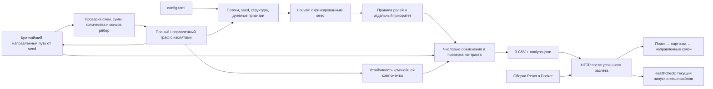

# Схема и пятиминутное демо



Один сервис Docker Compose. Первая сборка устанавливает зависимости и
собирает UI; каждый старт заново рассчитывает данные. Сервер обслуживает
только каталог результата. Браузер не вычисляет роли и скоры.
[Отдельный слайд для защиты](../submission/overview.svg) открывается в
браузере без сборки и внешних ресурсов.

## 0:00–0:35 — запуск и задача

```sh
docker compose up -d --build --wait --wait-timeout 360
docker compose ps
```

Показать команду воспроизведения и слайд. Первая сборка зависит от сети и
может занять дольше пяти минут; для живого пересчёта заранее собрать образ,
затем выполнить `docker compose restart app` и показать новый лог
`Analysis complete`. Открыть http://localhost:8080. «Задача — выбрать, кого
проверять первым и почему; роли — гипотезы, не доказательство нарушения».

## 0:35–1:30 — найденный за пределами seed распределитель

В «Общие узлы известных клиентов» ввести исходные gid
`100000003016635100` и `100000004269433100`. Открыть первый результат
`100000008346837100` (№ 2 в приоритете; не входит в 81 исходный gid).
Показать отдельный наблюдаемый путь от каждого источника: 2 и 4 шага.
Показать 9 плательщиков, 25 получателей, долю крупнейшего получателя 26%,
входящие/исходящие и стрелки. В карточке охват, структура
и оборот дают соответственно 0,263, 0,349 и 0,209 из итоговых 0,821.
Это ранжирование наблюдаемой структуры, а не вывод о виновности.
Пути не доказывают движение тех же денег.

## 1:30–2:20 — транзит и следующий запрос

Найти `100000000661912100`. Показать out/in=1,10, долю выхода в день входа
или следующие два дня 75%, альтернативные роли и список переводов.
Показать путь и следующий запрос на хронологию операций и остатки счёта.
«Близость дат не доказывает трассировку тех же средств».

## 2:20–3:20 — граничный узел и четыре шага

Найти `100000000018102100`: depth=4. Объяснить, почему отсутствие выхода
не означает удержание. Показать наблюдаемый путь из четырёх рёбер с суммами,
предупреждение и следующий запрос на продолжение обхода.

## 3:20–4:10 — кластеры и устойчивость

Раскрыть кластер: гипотеза основана на внешнем входе/выходе, seed и числе
узлов с выраженными ролями. Затем раскрыть «Устойчивость наблюдаемой сети»:
исключение топ‑10 уменьшает крупнейший фрагмент с 1 877 до 1 414 узлов;
контроль по степени даёт 1 371, медиана случайных исключений — 1 860.
Это модель связности выборки, не прогноз реальной блокировки.

## 4:10–5:00 — выгрузки и проверка произвольного gid

Скачать nodes_roles.csv, clusters.csv и top_nodes.csv. Везде числовые
основания; gid в браузере сохранён строкой без потери точности.
Показать, что поиск работает по всем узлам независимо от фильтров: можно
ввести gid, названный жюри. Если требуется, показать изолят
`100000000456947100` и сообщение для неизвестного `999`.
Упомянуть число тестов и фактическое время из лога. Роль coordinator
чувствительна к порогам; проверка порогов и модель связности — разные виды
устойчивости, ни один не измеряет accuracy.

Приведённые gid — только примеры для демо на исходном датасете; расчёт
их не содержит. При изменении данных выбрать примеры по текущим выгрузкам.
