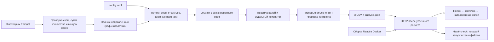

# Схема и пятиминутное демо



Один сервис Docker Compose. Первая сборка устанавливает зависимости и
собирает UI; каждый старт заново рассчитывает данные. Сервер обслуживает
только каталог результата. Браузер не вычисляет роли и скоры.

## 0:00–0:40 — запуск и задача

```sh
docker compose up -d --build --wait --wait-timeout 360
docker compose ps
```

Открыть http://localhost:8080. «Задача — выбрать, кого проверять первым,
и увидеть числовые основания. Роли — гипотезы, не доказательство нарушения».
Показать 2248 узлов и топ-лист. Первая сборка может занять дольше демо;
для живого пересчёта заранее собрать образ, затем выполнить `docker compose restart`.

## 0:40–1:40 — распределение

Найти `100000003016635100` (лидер исходного расчёта).
Показать 73 получателя, долю крупнейшего 9%, входящие/исходящие и стрелки.
Раскрыть состав приоритета. Объяснить: структура и охват дают 75% веса,
оборот 25%; вход seed неполон, поэтому отношение баланса не определяет роль.
Переключить граф на кластер и показать счётчик скрытых элементов/расширение.

## 1:40–2:40 — транзит

Найти `100000000661912100`. Показать out/in=1,10, долю выхода в день входа
или следующие два дня 75%, альтернативные роли и список переводов.
«Это наблюдаемая близость дат, а не доказанная трассировка тех же средств».

## 2:40–3:40 — граничный узел

Найти `100000000018102100`: depth=4. Объяснить, почему отсутствие выхода
не означает удержание. Показать предупреждение. Для сравнения при наличии
времени — `100000004015047100`: гипотеза удержания, вход 919104 ₸,
out/in=0,08, внутри наблюдаемой границы.

## 3:40–4:20 — полнота и восстановление

Найти изолят `100000000456947100`: карточка есть, связей 0.
Ввести неизвестный gid `999` и показать понятный результат поиска.
Выбрать фильтры и сбросить их. Подчеркнуть: поиск работает по всем узлам,
даже если они скрыты фильтром таблицы.

## 4:20–5:00 — выгрузки и ограничения

Скачать nodes_roles.csv, clusters.csv и top_nodes.csv. Везде числовые
основания; gid в браузере сохранён строкой без потери точности.
Упомянуть 30 аналитических тестов, повторяемость и фактический замер из
лога текущего запуска. coordinator чувствителен к порогам; ±10% — это
анализ устойчивости, не оценка accuracy. Следующий запрос аналитика:
полные входящие seed, продолжение depth=4, соседние периоды.

Приведённые gid — только примеры для демо на исходном датасете; расчёт
их не содержит. При изменении данных выбрать примеры по текущим выгрузкам.
